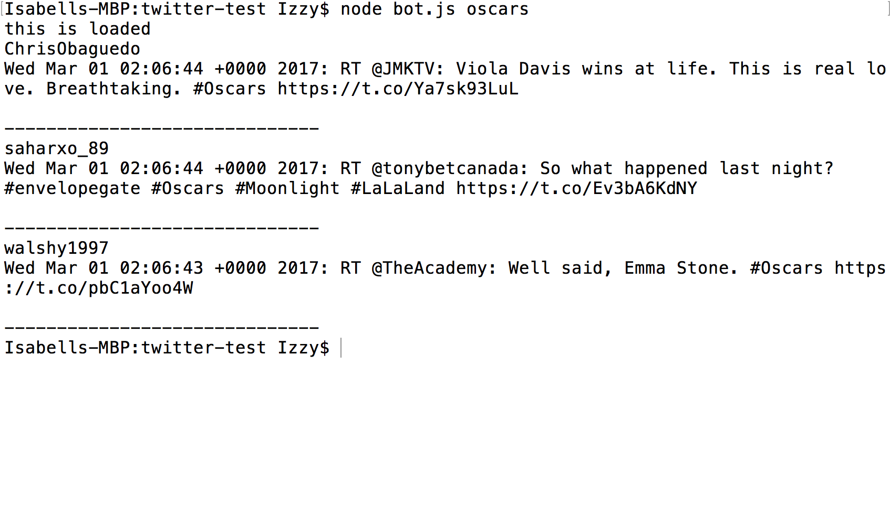
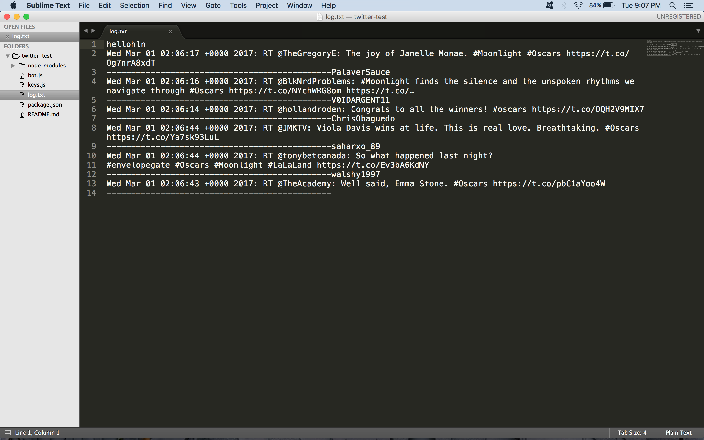

# twitter-test

### This is a command line node app that uses the Twitter NPM package to generates 3 tweets from the hashtag of the user's choice.

### To use this app: 
	1. simply clone the repository
	2. npm install everything in the package.json
	3. create an app on https://dev.twitter.com/ to retrieve the consumer key, consumer secret, access token key, and access token secret. Place these values in a file called keys.js with the structure like this:
		exports.twitterKeys = {
		    consumer_key: 'Consumer Key',
		    consumer_secret: 'Consumer Secret',
		    access_token_key: 'Access Token Key',
		    access_token_secret: 'Access Token Key',
		}
	4. open up your terminal/git bash.
	Type into the terminal: node bot.js <<hashtag subject without the # symbol>>
	For example, to look up the hashtag #oscars you would type in:
		node bot.js oscars
	All tweets are saved in the log.txt file

### Technologies
* [Node.js](https://nodejs.org/en/) - evented I/O for the backend
* [Javascript](https://developer.mozilla.org/en-US/docs/Web/JavaScript) - lightweight interpreted or JIT-compiled programming language with first-class functions
* [Twitter NPM](https://www.npmjs.com/package/twitter) - Twitter API client library for Node.js

### Below is an image of the app.

* This is the hashtag search.

* This is the log with the saved tweets.

